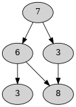

# Assumptions

## Insertion

The a new number is always inserted from top to bottom, left to right.
For example:

|1                           |2                           |3                           |
|----------------------------|----------------------------|----------------------------|
||||

## Input

There is no difference between a file with inline numbers or with new
lines. The following input files give the same result:

```
# File 1
1
1 2
3 4 5

# File 2
1 2 3 4 5
```

## Completion

It's possible to have an incomplete triangle:


The minimum path is calculated either way. It should be `7 + 3 = 10`.