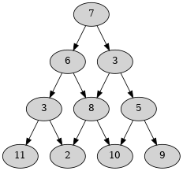

# Minimum Triangle Path

This is an application to calculate the minimal path in a triangle of
numbers.

A triangle of numbers can be represented like so:



A path is a sequence of connected nodes. For example,
`7 -> 6 -> 3 -> 11` is path from the left the triangle.

The minimal path is the path whose sum of values is lower than any other
path. In the following example `7 -> 6 -> 3 -> 2` is the minimal path.

This application only gives one of the possible minimal paths.

## Run

To run this application:

```
$ sbt "run <file>"
```

Where the file can be:

```
7
6 3
3 8 5
11 2 10 9
```

Which will give the following result:

```
7 + 6 + 3 + 2 = 18
```

The `examples` directory contains file examples:

```
$ sbt "run examples/test-file-3.txt"
7 + 6 = 13
```