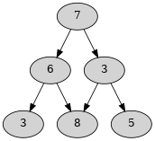
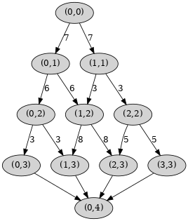

# TODO

This application could be improved further.

## Concatenation support

The `TriangleNumbers` could have a concatenation operation like so:

```
val a = TriangleNumber(7, 6, 3) ++ Triangle(3, 8, 5)
```

Which would return the following graph:



If the last node is known it's easy to figure and add the next edges.
Perhaps one solution is to store the last node. Concatenation would be
efficient since adding one edge costs `O(1)`.

## File Reading Optimization

Currently the all the numbers are being read into an array buffer to
create the triangle graph. This obviously costs a lot of memory.

If concatenation is supported it's possible to put each line to create a
new larger graph instead of creating a giant graph from a giant list.

## Shortest Path Optimization

Currently the shortest path is being calculated by getting the shortest
of all shortest paths from root to leaves. This may cost to much for
very large data sets.

A possible solution is for all leaves to connect to one last node, like
so:



With that final node it's possible to use scala graph shortest path from
root to the final node. The cost would be `O(VlogV + E)`.